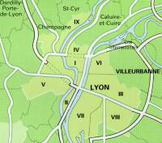

Liens
=====

Principaux partenaires
----------------------

* [Fédération Lyonnaise de Modélisation et Sciences Numériques (FLMSN)](http://www.flchp.univ-lyon1.fr)
* [Pôle Scientifique de Modélisation Numérique (PSMN)](http://www.ens-lyon.fr/PSMN/doku.php)
* [Institut des Sytèmes Complexes ( IXXI )](http://www.ixxi.fr/?lang=fr)
* [Pôle Bioinformatique Lyonnais](http://pbil.univ-lyon1.fr)
* [Ecole Normale Supérieure de Lyon (ENS de Lyon)](http://www.ens-lyon.eu)
* [Centre Européen de Calcul Atomique et Moléculaire (CECAM)](http://www.cecam.org/mission.html)
* [Centre Français de Calcul Atomique et Moléculaire – Rhône-Alpes (CFCAM-RA)](http://www.cfcam-ra.fr)
* [Université de Lyon](http://www.universite-lyon.fr/)
* [CIRA : Calcul intensif en Rhône-Alpes](http://www.ci-ra.org/)
* [LyonCalcul](http://lyoncalcul.univ-lyon1.fr/spip.php)

Centres de calcul
-----------------

* [Pôle de Compétence en Calcul Haute Performance Dédié (PCCHPD)](http://www.p2chpd.univ-lyon1.fr/)
* [Pôle de Modélisation et de Calcul en Sciences de l'Ingénieur et de l'Information (PMCSII)](http://www.ec-lyon.fr/47342913/0/fiche___pagelibre/&RH=)
* [Centre  de calcul de l'Institut national de physique nucléaire et physique des particules (CC-IN2P3)](http://cc.in2p3.fr)
* [Réseau National des plates-formes Bioinformatiques (Renabi)](http://www.renabi.fr/)
* [Calcul Intensif / Modélisation / Expérimentation Numérique et Technologique (Ciment)](http://ciment.ujf-grenoble.fr/wiki-pub/index.php/Welcome_to_the_CIMENT_site!)
* [PRACE (Partnership for Advanced Computing in Europe)](http://www.prace-ri.eu/?lang=en)

Laboratoires
------------

{.img-float .pe-2}

La région Rhône-Alpes est le 2e pôle français de R&D. L'aglomération lyonnaise à elle seule compte 120 000 étudiants (dont 15 000 en 3e cycle), plus de 300 laboratoires de recherche publique et 7 sites scientifiques et technologiques, cinq pôles de compétitivité dont un pôle "mondial", Lyon BioPôle, et un pôle "à vocation mondiale", AXELERA. Le Pôle Universitaire de Lyon (PUL) regroupe 16 établissements (dont l’Université Claude Bernard Lyon 1, l’Ecole Normale Supérieure de Lyon, l’Ecole Centrale de Lyon, l’INSA de Lyon et l' Institut Polytechnique de Lyon comprenant le CPE Lyon, l’ECAM Lyon, l'ISARA Lyon et l'ITECH Lyon). L’université de Lyon a identifié dans sa stratégie de recherche la modélisation et le calcul scientifiques comme une thématique forte et transverse à l’ensemble des établissements.    

* [Institut Camile Jordan](http://math.univ-lyon1.fr/)
* [Laboratoire de Physique de la Matière Condensée et Nanostructure](http://www-lpmcn.univ-lyon1.fr/site/)
* [Laboratoire de Physique](http://www.ens-lyon.fr/PHYSIQUE)
* [Centre de Recherches Astronomiques de Lyon (Cral)](http://www-obs.univ-lyon1.fr/)
* [Laboratoire de géologie de Lyon : Terre, Planète, Environnement](http://geologie.ens-lyon.fr/lgltpe)
* [Institut de recherche sur la catalyse](http://catalyse.univ-lyon1.fr/)
* [Laboratoire de Spectrométrie ionique et moléculaire](http://www-lasim.univ-lyon1.fr/)
* [Institut de Médecine théorique](http://imth.univ-lyon1.fr/)
* [Laboratoire Biologie Fonctionnelle Insecte et Interactions](http://bf2i.insa-lyon.fr/)
* [Laboratoire de Mécanique des Fluides et d’Acoustique](http://www.lmfa.ec-lyon.fr/)
* [Laboratoire de Tribologie et de Dynamique des Systèmes](http://ltds.ec-lyon.fr/)
* [Laboratoire Ampère (ex Centre de Génie Electrique de Lyon)](http://www.ampere-lab.fr/)
* [Groupe d'Etude de Métallurgie Physique et de Physique des matériaux](http://mateis.insa-lyon.fr/)
* [Laboratoire de Mécanique des Contactes](http://lamcos.insa-lyon.fr/)
* [Centre de Thermique de Lyon](http://www.insa-lyon.fr/cethil/)
* [Laboratoire d'Informatique du Parallèlisme](http://www.ens-lyon.fr/LIP/)
* [Laboratoire d’Informatique en Image et Système d’Information](http://liris.cnrs.fr/)
* [Institut des NanoTechnologies de Lyon (ex Laboratoire d’Electronique Opto­électronique et Microsystèmes)](http://inl.cnrs.fr//)
* [Institut des Sytèmes Complexes (IXXI) ](http://www.ixxi.fr/)
* [Centre Henri Benard](http://www.lmfa.ec-lyon.fr/Henri.Benard/presentation/)
* [Pôle Bioinformatique Lyonnais](http://pbil.univ-lyon1.fr/)
* [PRABI (Rhône-Alpes Bioinformatics Center)](http://www.prabi.fr)
* [C'nano Rhône-Alpes : Centre de compétence NanoSciences Rhône-Alpes](http://www.cnano-rhone-alpes.org/)
* [Le groupe Calcul](http://calcul.math.cnrs.fr/)

Écoles doctorales
-----------------

* [École doctorale Informatique et Mathématiques (InfoMaths)](http://math.univ-lyon1.fr/~kellendonk/MathIf/)
* [École doctorale Physique et Astrophysique (PHAST)](http://phast.univ-lyon1.fr/)
* [École doctorale de Chimie de Lyon (ED 206)](http://www.edchimie-lyon.fr/html/)