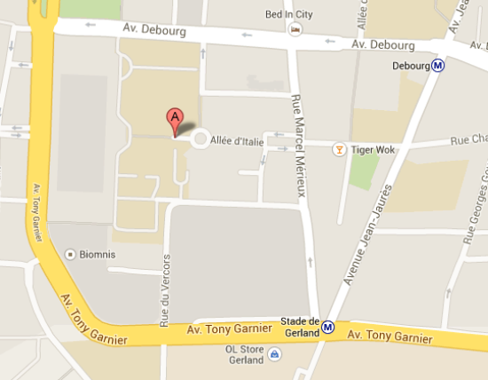

Accès aux sites
===============

Adresse
-------

**PSMN** et **CBP**

Pôle Scientifique de Modélisation Numérique (PSMN)
ENS de Lyon
46, allée d'Italie
69364 Lyon Cedex 07
France 

Le Centre Blaise Pascal se situe sur le Campus “Monod”.
    
Les bureaux du PSMN se situent sur le Campus “Monod”, batiment M7 (étage 1H). 

Accès
-----

Plan d'accès: 

{.img-fluid .center}

Pour se rendre à l'ENS-Lyon
---------------------------

**De l'aéroport de Lyon-Saint Exupéry :**

* Prenez le train Rhônexpress jusqu'à la gare de Lyon Part-Dieu.

**Depuis la gare de Lyon Part-Dieu :**

* Prenez la sortie “Vivier Merle”,
* puis prenez le Métro ligne B, direction “Gare d'Oullins”.
* Descendez à la station “Debourg” ou “Stade de Gerland”.

**Depuis la gare de Lyon Perrache :**

* prenez le Tram T1 direction “Debourg”,
* Descendez à la station “ENS Lyon”.

[Plan d'accès (pdf)](../_static/Acces/psmn_map.pdf) 

[Plan Métro-Tram-Bus (pdf)](../_static/Acces/plan_tcl_2024.pdf)

Hôtels
------

* [Séjour & Affaires Gerland](http://www.sejours-affaires.com/residence-hoteliere-aparthotel-lyon-172.html)
* [Séjour & Affaires Saxe Gambetta](http://www.sejours-affaires.com/residence-hoteliere-aparthotel-lyon-21.html)
* [Park & Suites Gerland](http://www.parkandsuites.com/en/appart-hotel-lyon-gerland.php?gclid=CMmr-Y7aw7ICFUXHtAod9CcA_w)
* [Bed in City Gerland](http://www.bedincity.net/)
* [Hôtel Ibis Gerland Mérieux](http://www.ibis.com/fr/hotel-0477-ibis-lyon-gerland-rue-merieux/index.shtml)
* [Hôtel Ibis Gerland Pasteur](http://www.ibis.com/fr/hotel-0778-ibis-lyon-gerland-7eme/index.shtml)
* [Novotel Gerland](http://www.novotel.com/fr/hotel-0736-novotel-lyon-gerland/index.shtml)
* [Hôtel des Facultés](http://www.hoteldesfacultes.com)