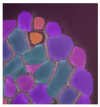

Proposition de stage de Master1/Master2 – 2013
==============================================

.. |br| raw:: html

    

Sujet: Segmentation d'images biologiques 3D en utilisant du calcul parallèle
----------------------------------------------------------------------------

{: .img-float .me-2} 

Un des problèmes clés dans l'imagerie quantitative en biologie est la segmentation correcte au niveau cellulaire des images confocales 3D des tissus. Les méthodes de segmentation de base que nous utilisons sont les méthodes watershed et level set combinés. Le but du stage est d'optimiser et donner une implémentation efficace de la méthode level set.

Pour cela, l'étudiant est invité à :

➢ étudier les méthodes d'analyse d'image que nous utilisons, |br|
➢ faire un revue des techniques d'optimisation et parallélisation, qui sont applicables à la méthode de segmentation level set |br|
➢ implémenter la méthode optimale et parallélisée en C++ |br|
➢ rendre l'implémentation sous forme d'un plugin sur des plateformes de calcul existants.

Environnement, lieu
-------------------

L'équipe Biophysique et Développement du Laboratoire RDP se concentre sur l'étude des mécanismes de morphogénèse en combinant des méthodes de la biologie cellulaire et moléculaire, de l'imagerie quantitative, des mesures physiques et modélisation. L'équipe est dans un environnement hautement pluridisciplinaire, au sein du Laboratoire Joliot Curie (LJC).

D'autre part, le CBP (Centre Blaise Pascal) est une “maison de la modélisation”, un lieu de conférences, recherche et de formation liées à la modélisation numérique dans tous les domaines scientifiques. Le PSMN (Pôle Scientifique de Modélisation Numérique) est la plate-forme scientifique de l'ENS de Lyon hébergeant les ressources en calcul haute performance.

Profile recherché
-----------------

* étudiant en 4e ou 5e année d'Université/École d'ingénieur
* compétences dans le calcul scientifique et développement de logiciels (C++, Python)
* la connaissance de la parallélisation (OpenMP, MPI, CUDA, OpenCL) est un plus
* autonomie, curiosité et créativité sont appréciées
* bonne capacité de communication écrite et orale

Directeurs de stage et contacts
-------------------------------

+------------------------------------+------------------------------------------------------------------+
| **Annamaria Kiss**                 | **Cerasela Iliana Calugaru**                                     | 
+====================================+==================================================================+
| annamaria.kiss@ens-lyon.fr         | cerasela.iliana.calugaru@ens-lyon.fr                             |
+------------------------------------+------------------------------------------------------------------+
| Ingénieur de Recherche             | Ingénieur de Recherche en Calcul Scientifique                    |
+------------------------------------+------------------------------------------------------------------+
| Laboratoire de Reproduction        | Centre Blaise Pascal (CBP)                                       |
| et Développement des Plantes (RDP) |                                                                  |
+------------------------------------+------------------------------------------------------------------+
| Laboratoire Joliot Curie (LJC),    | Pôle Scientifique de Modélisation Numérique (PSMN), ENS de Lyon  |
| ENS de Lyon                        |                                                                  |
+------------------------------------+------------------------------------------------------------------+
| Tél : 04 72 72 89 37               | Tél : 04 72 72 86 31                                             |
+------------------------------------+------------------------------------------------------------------+
| www.ens-lyon.fr/RDP                | www.cbp.ens-lyon.fr                                              |
+------------------------------------+------------------------------------------------------------------+
| www.ens-lyon.fr/Joliot-Curie       | www.ens-lyon.fr/PSMN                                             |
+------------------------------------+------------------------------------------------------------------+