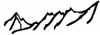
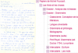
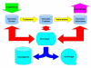

Projets d'infrastructure
========================

2016
----

<u>Houches 2016</u>

{.img-float .pe-3}

[Computational Physics : Computational Astrophysics](#)  
Maitrise d'oeuvre : Emmanuel Quemener

----

<u>Sidus4Labs @ ISA</u>

{.img-float .pe-3}

[Sidus4Labs @ ISA](#)  
Maitrise d'oeuvre : Emmanuel Quemener

----

<u>DH-Foucault (2016-20xx)</u>

{.img-float .pe-3 width=110px}

[Exploration d'outils numériques pour la bibliothèque Foucault](#)

Maitrise d'oeuvre : Emmanuel Quemener

----

<u>OIKO (2015-2016)</u>

{.img-float .pe-3}

[Sidus4Labs @ ISA](#)

Maitrise d'oeuvre : Emmanuel Quemener

2015
----

<u>Houches 2015</u>

{.img-float .pe-3}

[Computational Physics : Multiscale modeling of materials](#)  
Maitrise d'oeuvre : Emmanuel Quemener

----

<u>Galaxy</u>

{.img-float .pe-2 width=150px}

[Galaxy Easy Gateway for Biological ENS Laboratories](#)  
Maitrise d'oeuvre : Emmanuel Quemener

2014
----

<u>Houches 2014</u>

{.img-float .pe-3}

[Computational Physics : From quantum gases to strongly correlated systems](#)  
Maitrise d'oeuvre : Emmanuel Quemener

2013
----

<u>UMPA</u>

{.img-float .pe-3}

[Evolution de l'infrastructure informatique de l'UMPA](#)  
Maitrise d'oeuvre : Emmanuel Quemener

----

<u>Houches 2013</u>

{.img-float .pe-3}

[Computational Physics : from DNA to evolution](#)  
Maitrise d'oeuvre : Emmanuel Quemener

----

<u>Projet de création, administration et maintenance du site web du CBP (2013-20xx)</u>

{.img-float .pe-3 width=100px}

[Site web collaboratif du Centre Blaise Pascal](#)

Coordination : Samantha Barendson & Loïs Taulelle

----

<u>Projet de création, administration et maintenance du site web du PSMN (2013-20xx)</u>

{.img-float .pe-3}

[Site web collaboratif du Pole Scientifique de Modélisation Numérique](#)  
Coordination : Loïs Taulelle & Samantha Barendson

----

<u>ENVeMedis (2013-20xx)</u>

{.img-float .pe-3 width=100px}

[Exploration de nouveaux vecteurs de médiation et de diffusion des savoirs](#)

Maitrise d'oeuvre : Emmanuel Quemener  

2012
----

<u>Houches 2012</u>

{.img-float .pe-3} 

[Computational Physics : DFT](#)  
Maitrise d'oeuvre : Emmanuel Quemener

----

<u>Equip@Meso (2012-20XX)</u>

{.img-float .pe-3}

[Stockage Temporaire Hautes Performances](#)  
Maitrise d'oeuvre : Emmanuel Quemener

2011
----

<u>Houches 2011</u>

{.img-float .pe-3}

[Computational Physics : soft matter](#)  
Maitrise d'oeuvre : Emmanuel Quemener

----

<u>VASP 4 Workstation</u>

{.img-float .pe-3}

[Vasp Running on my workstation](#)

Maitrise d'oeuvre : Emmanuel Quemener

----

<u>Projet de développement, administration et maintenance du site web collaboratif pour le CFCAM-RA (2011-20XX)</u>

{.img-float .pe-3}

[Site web du Centre Français de Calcul Atomique et Moléculaire – Rhône-Alpes](#)  
Coordination : Cerasela Calugaru / Assistance : Samantha Barendson

2010
----

<u>Enquêtes Stockages ENS</u>

{.img-float .pe-3}

[Enquêtes sur les Besoins de Stockage de l'ENS-Lyon](#)

Maitrise d'oeuvre : Emmanuel Quemener

----

<u>SIDUS 2010-2021</u>

    
    

        
<a href="#">Single Instance Distributing Universal System</a>

        
Maitrise d'oeuvre : Emmanuel Quemener

    

2009
----

<u>From Cecam to CBP</u>

{.img-float .pe-3}

[Du Cecam à l'ENS-Lyon au Centre Blaise Pascal](#)  
Maitrise d'oeuvre : Emmanuel Quemener

----

<u>Projet de développement, administration et maintenance du site web collaboratif pour le PSMN (2009 - avril 2013)</u>

{.img-float .pe-3}

[Site web collaboratif du Pole Scientifique de Modélisation Numérique](#)  
Coordination : Cerasela Calugaru

----

<u>Création du plateau technique de multi-noeuds</u>

{.img-float .pe-3 width=100px}

[Plateau Technique Multi-Noeuds](#)

Maitrise d'oeuvre : Emmanuel Quemener

----

<u>Création d'une passerelle OpenVPN pour l'établissement</u>

{.img-float .pe-3}

[Création d'une passerelle OpenVPN](#)  
Maitrise d'oeuvre : Emmanuel Quemener

2008
----

<u>Projet de développement, administration et maintenance du site web collaboratif pour le CBP (2008 - avril 2013)</u>

{.img-float .pe-3}

[Site web collaboratif du Centre Blaise Pascal](#)

Coordination : Cerasela Calugaru
